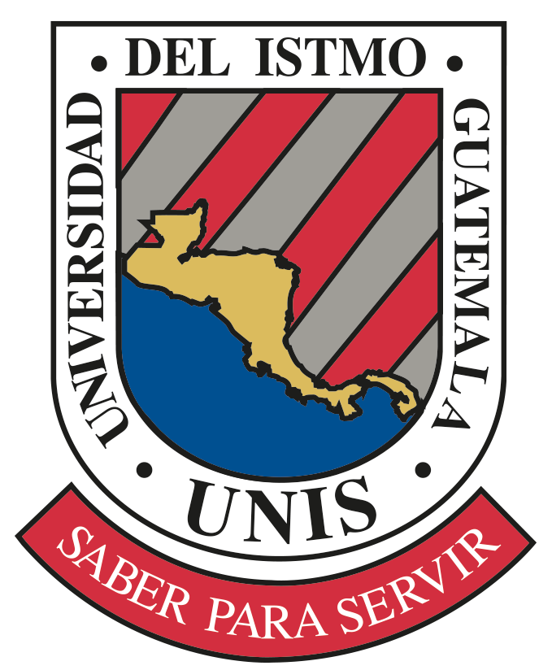

  

# Repositorio de Sistemas Digitales

Este repositorio contiene los proyectos y exámenes prácticos desarrollados durante el curso de **Sistemas Digitales**, enfocados en el diseño de hardware avanzado, lógica programable y sistemas embebidos.

 

## **Estructura del Proyecto**

 

El repositorio está organizado por hitos académicos, documentando la evolución desde lógica de control hasta sistemas integrados:

 

### **Parcial 1: Control de Acceso (FSM)**

* **Basys3_Parciales**: Implementación de un sistema de control para un parqueo[cite: 1].
* Utiliza una arquitectura de dos máquinas de estados: una **Máquina de Mealy** para gestionar el sistema de pago y una **Máquina de Moore** para el control de la talanquera[cite: 1].

 

### **Parcial 2: Diseño de Videojuegos en FPGA**

* **Parcial2_SD**: Desarrollo del juego **"UNIS Invaders"**, un videojuego con temática universitaria diseñado para la Basys 3[cite: 1].
* Implementación completa de lógica de video VGA y control de juego ejecutado directamente en la tarjeta[cite: 1].

  
  

 

### **Parcial 3: Aritmética Digital Avanzada**

* **ALU (Arithmetic Logic Unit)**: Diseño modular de una unidad aritmética de alto rendimiento[cite: 1].
* Incluye implementaciones de sumadores tipo **CLA de 4 bits** (Carry Look-Ahead) y **Prefix Adders**[cite: 1].
* Funciones adicionales de desplazamiento: **Shift Left** y **Shift Right**[cite: 1].
* **Demostración**: Se incluye el archivo `ALU_KaterinSagastume_P3.mp4` con la simulación completa de las operaciones[cite: 1].

 

### **Parcial Final: Sistema Transaccional Embebido**

* **Cajero Final**: Proyecto integrador que simula el funcionamiento de un cajero automático[cite: 1].
* A diferencia de los módulos anteriores, este sistema fue implementado utilizando la placa **NUCLEO-L053R8**[cite: 1].
* Incluye el código fuente y un video demostrativo del funcionamiento del hardware en tiempo real[cite: 1].

  
  

 

## **Herramientas y Tecnologías**

 

* **Lenguajes**: SystemVerilog / Verilog y C para sistemas embebidos[cite: 1].
* **Hardware**: 
    * **Basys 3 FPGA** (Artix-7) para lógica programable[cite: 1].
    * **STM32 Nucleo-L053R8** para el proyecto final[cite: 1].
* **Software**: Xilinx Vivado (Síntesis e Implementación) y entornos para microcontroladores STM32[cite: 1].

 

## **Autor**

 

**Káterin Sagastume**  
Estudiante de 5to año de Ingeniería en Electrónica y Telecomunicaciones  
Universidad del Istmo de Guatemala[cite: 1]
